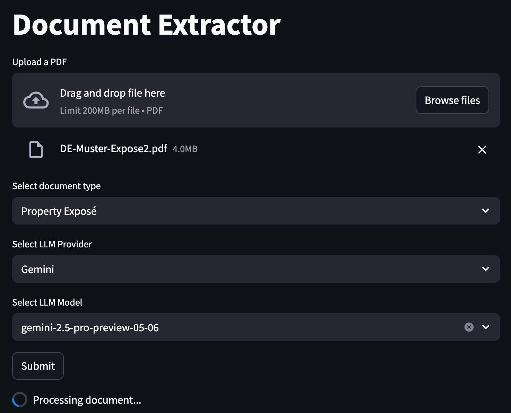
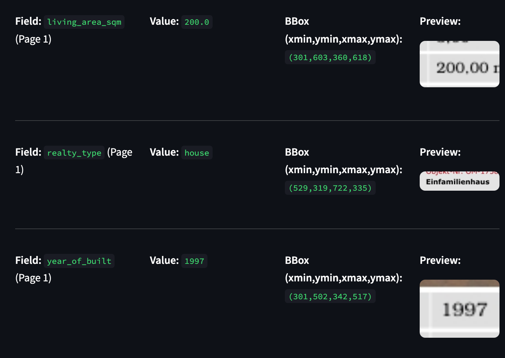

<div id="top"></div>

<!-- PROJECT LOGO -->
<br />
<div align="center">
  <!-- TODO: Add a relevant GIF or screenshot for doc-extractor -->
  

  <h1 align="center">Document Extractor</h1>
  <h4 align="center">A Python application for extracting structured information from documents using Large Language Models.</h4>

  <!-- BADGES -->
  <p align="center">
    <!-- TODO: Update GitHub username and repo name if needed -->
    <a href="https://github.com/CarlosUziel/doc-extractor/blob/main/LICENSE"></a>
    <a href="https://github.com/CarlosUziel/doc-extractor/stargazers"></a>
  </p>
  
  <p align="center">
    <a href="#-motivation">Motivation</a> •
    <a href="#-getting-started">Getting Started</a> •
    <a href="#-contact">Contact</a>
  </p>
</div>

<!-- TABLE OF CONTENTS -->
<details>
  <summary>📋 Table of Contents</summary>
  <ol>
    <li><a href="#-motivation">🧠 Motivation</a></li>
    <li>
      <a href="#-getting-started">🚀 Getting Started</a>
      <ul>
        <li><a href="#prerequisites">Prerequisites</a></li>
        <li><a href="#installation">Installation</a></li>
        <li><a href="#usage">Usage</a></li>
      </ul>
    </li>
    <li><a href="#-features">✨ Features</a></li>
    <li><a href="#-workflow-overview">📜 Workflow Overview</a></li>
    <li><a href="#-configuration-options">⚙️ Configuration Options</a></li>
    <li><a href="#-file-descriptions">📂 File Descriptions</a></li>
    <li><a href="#-benchmarking">📊 Benchmarking</a></li>
    <li><a href="#-performance-analysis-and-llm-comparison">📊 Performance Analysis and LLM Comparison</a></li>
    <li><a href="#-license">📄 License</a></li>
    <li><a href="#-additional-notes">📝 Additional Notes</a></li>
    <li><a href="#-potential-improvements-and-future-work">💡 Potential Improvements and Future Work</a></li>
    <li><a href="#-contact">👤 Contact</a></li>
    <li><a href="#-acknowledgments">🙏 Acknowledgments</a></li>
  </ol>
</details>

## 🧠 Motivation

Extracting structured information from diverse document types like EPC certificates or property exposés can be a complex and time-consuming task. This project aims to automate this process by leveraging the power of multimodal Large Language Models (LLMs).

The `doc-extractor` provides a Streamlit-based web application that allows users to:
*   Upload PDF documents.
*   Specify the document type (e.g., EPC Certificate, Property Exposé).
*   Choose an LLM provider (OpenAI or Google Gemini) and a specific model.
*   Extract key information from the documents, which is then parsed into a predefined schema.
*   View the extracted data and visual previews of where the information was found (if bounding box data is available).

Additionally, the project includes a benchmarking suite to evaluate and compare the performance of different LLMs and configurations for various document types.

<p align="right">(<a href="#top">back to top</a>)</p>

<!-- GETTING STARTED -->
## 🚀 Getting Started

### Prerequisites

Before you begin, ensure you have the following installed:

*   **Python**: Version 3.12 or higher (as specified in `pyproject.toml`).
*   **uv**: A fast Python package installer and resolver. [Installation Guide](https://github.com/astral-sh/uv)
*   **PYTHONPATH**: For the benchmark scripts and potentially other utilities to correctly locate modules within the `src` directory when run from the project root, you'll need to add the `src` directory to your `PYTHONPATH`.
    *   For bash/zsh:
        ```bash
        export PYTHONPATH=./src:$PYTHONPATH
        ```
    *   For fish shell:
        ```fish
        set -x PYTHONPATH ./src $PYTHONPATH
        ```
    You can add this to your shell's configuration file (e.g., `~/.bashrc`, `~/.zshrc`, `~/.config/fish/config.fish`) to set it automatically for new terminal sessions when working on this project.

### Installation

1.  Clone this repository (replace `CarlosUziel/doc-extractor` if your repository URL is different):
    ```bash
    git clone https://github.com/CarlosUziel/doc-extractor.git
    cd doc-extractor
    ```

2.  Install project dependencies using uv:
    ```bash
    uv sync
    ```

3. Alternatively, you can use pip to install the dependencies:
    ```bash
    pip install -r requirements.txt
    ```

<p align="right">(<a href="#top">back to top</a>)</p>

### Usage

1.  **Set up Environment Variables**:
    Copy the example environment file `.env.dist` to `.env`.
    ```bash
    cp .env.dist .env
    ```
    
    Modify `.env` with your API keys for OpenAI and/or Google Gemini:
    ```env
    OPENAI_API_KEY="sk-your_openai_api_key_here"
    GEMINI_API_KEY="your_google_gemini_api_key_here"
    ```

2.  **Start the Streamlit App**:
    Launch the Streamlit application from the project's root directory.
    ```bash
    streamlit run src/app/app.py
    ```
    The application will open in your web browser, allowing you to upload documents and extract information.

<p align="right">(<a href="#top">back to top</a>)</p>

## ✨ Features

*   **PDF Document Processing**: Upload and process PDF files.
*   **Multimodal LLM Integration**: Supports information extraction using OpenAI (e.g., GPT-4o, GPT-4o-mini) and Google Gemini models.
*   **Flexible Document Types**: Configurable for different document schemas (e.g., EPC Certificates, Property Exposés).
*   **Structured Output**: Extracted information is parsed into Pydantic models, ensuring data consistency.
*   **Benchmarking Suite**: Tools to generate predictions across multiple documents and LLMs, and evaluate their performance.
*   **Configurable Prompts**: Prompts for LLMs are centralized and can be customized.
  
### Bonus Features

*   **Bounding Box Extraction**: The system is capable of extracting bounding box coordinates for located text (if supported by the LLM and schema), which can be used for visual feedback in the application.
*   **Interactive Streamlit Application**: A user-friendly Streamlit web application is provided for easy document uploading, LLM configuration, and viewing extraction results.

<br />
<div align="center">
  
</div>
<br />

<p align="right">(<a href="#top">back to top</a>)</p>

## 📜 Workflow Overview

The core document extraction process follows these steps:

1.  **Document Upload**: The user uploads a PDF document through the Streamlit interface.
2.  **Page Selection (Optional)**: The user can specify particular pages to process, or all pages by default.
3.  **Image Conversion**: The selected PDF pages are converted into base64 encoded PNG images using `PyMuPDF`.
4.  **LLM Invocation**:
    *   The application constructs a prompt based on the selected document type and the predefined prompt templates (see `src/config/prompts.py`).
    *   The images and the prompt (requesting JSON output according to a schema) are sent to the chosen multimodal LLM (OpenAI or Gemini).
5.  **Response Parsing**:
    *   The LLM's JSON response is received.
    *   This response is parsed and validated against the corresponding Pydantic schema (e.g., `EPCCertificateDetails`, `PropertyExposeDetails` from `src/config/schema.py`).
6.  **Display Results**: The extracted and structured information is displayed in the Streamlit app. If bounding box data is present, it can be used to highlight information on the document previews.

<p align="right">(<a href="#top">back to top</a>)</p>

## ⚙️ Configuration Options

The application's behavior can be customized through environment variables defined in the `.env` file.

*   `OPENAI_API_KEY`: Your API key for accessing OpenAI models.
    *   Required for using OpenAI models.
*   `GEMINI_API_KEY`: Your API key for accessing Google Gemini models.
    *   Required for using Gemini models.

These settings are managed by `pydantic-settings` in `src/config/settings.py`.

LLM provider and model selection are handled directly within the Streamlit application UI and as command-line options in the benchmarking scripts.

<p align="right">(<a href="#top">back to top</a>)</p>

## 📂 File Descriptions

*   `src/app/app.py`: Implements the Streamlit web application for user interaction, document uploading, LLM configuration, and displaying extraction results.
*   `src/benchmark/generate_predictions.py`: Command-line script to run batch predictions using specified LLMs on a dataset of documents. Useful for generating data for benchmarking.
*   `src/benchmark/evaluate_predictions.py`: Command-line script to evaluate the predictions generated by `generate_predictions.py` against ground truth or compare different models.
*   `src/config/logger.py`: Configures the application-wide logger (using Loguru).
*   `src/config/prompts.py`: Contains standardized prompt templates used to instruct the LLMs for information extraction.
*   `src/config/schema.py`: Defines Pydantic models for the structured data to be extracted (e.g., `EPCCertificateDetails`, `PropertyExposeDetails`, `BoundingBox`). These schemas are crucial for validating LLM outputs.
*   `src/config/settings.py`: Manages application settings (like API keys) using Pydantic, loading them from a `.env` file.
*   `src/pipelines/doc_extraction.py`: Contains the core logic for the document extraction pipeline, including loading PDFs, calling LLMs, and parsing their responses.
*   `src/pipelines/utils.py`: Provides utility functions supporting the extraction pipeline, such as PDF-to-image conversion (`load_pdf_images`), LLM client instantiation (`get_llm`), and prompt/parser retrieval (`get_prompt_and_parser`).
*   `pyproject.toml`: Project metadata and dependencies, managed by `uv`.
*   `annotations/`: Directory intended to store annotation data, potentially ground truth for benchmarking.
*   `reports/`: Directory where evaluation reports from the benchmarking scripts are saved.

<p align="right">(<a href="#top">back to top</a>)</p>

## 📊 Benchmarking

The project includes scripts to facilitate the benchmarking of different LLM providers and models for the document extraction task.

1.  **Generate Predictions**:
    Use `src/benchmark/generate_predictions.py` to process a directory of documents and save the LLM extractions.
    Example:
    ```bash
    python src/benchmark/generate_predictions.py --llm-provider gemini --llm-model gemini-2.5-pro-preview-05-06 --data-base-path .data/ --annotations-base-path annotations/ --limit 10
    ```
    This command will process up to 10 documents for each document type found in `.data/` using the specified Gemini model and save the outputs in the `annotations/` directory, structured by document type and model name.

    > [!NOTE]
    >
    > Refer to the script's help (`python src/benchmark/generate_predictions.py --help`) for more details on available commands and options.

2.  **Evaluate Predictions**:
    Use `src/benchmark/evaluate_predictions.py` to analyze the generated predictions. This script can calculate metrics like missing values and compare outputs against a ground truth dataset (if available) or between different models.
    Example for analyzing a single model (missing value analysis):
    ```bash
    python src/benchmark/evaluate_predictions.py --skip-comparison --test-model-name gemini-2.5-pro-preview-05-06
    ```
    Example for comparing two models:
    ```bash
    python src/benchmark/evaluate_predictions.py --skip-missing --ground-truth-model-name gemini-2.5-pro-preview-05-06 --test-model-name gpt-4o-mini
    ```
    To run both analyses (missing values for all models found, and a specific comparison):
    ```bash
    python src/benchmark/evaluate_predictions.py --ground-truth-model-name gemini-2.5-pro-preview-05-06 --test-model-name gpt-4o-mini
    ```
    > [!NOTE]
    >
    > Refer to the script's help (`python src/benchmark/evaluate_predictions.py --help`) for more details on available commands and options.

    

<p align="right">(<a href="#top">back to top</a>)</p>

## 📈 Performance Analysis and LLM Comparison

This section details the performance evaluation of different Large Language Models (LLMs) for extracting information from "EPC Certificate" and "Property Exposé" documents. The primary goal is to compare the accuracy of various models against a designated ground truth model.

### Evaluation Approach

The evaluation methodology is as follows:

1.  **Ground Truth (GT) Model**: `gemini-2.5-pro-preview-05-06` was selected as the ground truth model. Its extractions are considered the baseline for comparison.
2.  **Evaluated Models**: The primary models evaluated against the Ground Truth (`gemini-2.5-pro-preview-05-06`) in the example results include:
    *   `gpt-4o`
    *   `gpt-4o-mini`
    *   `gemini-2.5-flash-preview-05-20`
    The specific models and document types covered in the tables below depend on the available evaluation data at the time of generation.
3.  **Metrics**: The comparison focuses on standard classification metrics for each extracted field:
    *   **TP (True Positives)**: The model correctly extracted a value that matches the GT, and both are non-null.
    *   **FP (False Positives)**: The model extracted a value, but it either doesn't match the GT, or the GT was null and the model predicted a value.
    *   **TN (True Negatives)**: Both the model and the GT agree that the value is null (or not present).
    *   **FN (False Negatives)**: The model failed to extract a value (predicted null), but the GT had a non-null value.
    *   **Accuracy**: `(TP + TN) / (TP + FP + TN + FN)` - Overall correctness.
    *   **Precision**: `TP / (TP + FP)` - Of the values the model extracted, how many were correct.
    *   **Recall**: `TP / (TP + FN)` - Of the actual values present, how many did the model find.
    *   **Balanced Accuracy**: `(Recall + Specificity) / 2`, where Specificity is `TN / (TN + FP)`. This is useful for imbalanced datasets where one class (e.g., null values) might be much more frequent.

The `src/benchmark/evaluate_predictions.py` script was used to generate these metrics, comparing the JSON outputs of the evaluated models against those from `gemini-2.5-pro-preview-05-06`.

**Note on `realty_address`**: The `realty_address` field is a nested structure. In the evaluation, it is unnested into individual sub-fields (e.g., `realty_address__street_number`, `realty_address__city`). The tables below have been updated to reflect this. The metrics for these sub-fields should be populated after re-running the evaluation script with the latest code.

### Results

**Note:** The following results were generated on **21 May 2025** using commit ID **`a6a0523a7619db2d5e690e4ff30245b1b217b9b2`**.

#### EPC Certificate

Comparison of `gpt-4o`, `gpt-4o-mini`, and `gemini-2.5-flash-preview-05-20` against `gemini-2.5-pro-preview-05-06` (Ground Truth) for EPC Certificates.

| Field                               | Model                            | Accuracy | Precision | Recall | Balanced Acc. |
|-------------------------------------|----------------------------------|----------|-----------|--------|---------------|
| realty_address__street_number       | `gpt-4o`                         | 0.640    | 0.625     | **1.000**  | 0.550         |
|                                     | `gpt-4o-mini`                    | 0.640    | 0.652     | 0.938  | 0.524         |
|                                     | `gemini-2.5-flash-preview-05-20` | **0.800**| **0.792** | **1.000**  | **0.583**     |
| realty_address__street_name         | `gpt-4o`                         | 0.520    | 0.522     | 0.923  | 0.503         |
|                                     | `gpt-4o-mini`                    | 0.520    | 0.522     | 0.923  | 0.503         |
|                                     | `gemini-2.5-flash-preview-05-20` | **0.640**| **0.625** | **1.000**  | **0.550**     |
| realty_address__zip_code            | `gpt-4o`                         | 0.760    | 0.750     | **1.000**  | 0.571         |
|                                     | `gpt-4o-mini`                    | 0.720    | 0.810     | 0.850  | 0.525         |
|                                     | `gemini-2.5-flash-preview-05-20` | **0.800**| **0.826** | 0.950  | **0.575**     |
| realty_address__city                | `gpt-4o`                         | **0.880**| **0.875** | **1.000**  | **0.625**     |
|                                     | `gpt-4o-mini`                    | 0.840    | 0.870     | 0.952  | 0.601         |
|                                     | `gemini-2.5-flash-preview-05-20` | 0.720    | 0.739     | 0.944  | 0.544         |
| epc_before_renovations              | `gpt-4o`                         | 0.640    | 0.647     | 0.786  | 0.620         |
|                                     | `gpt-4o-mini`                    | **0.680**| 0.647     | **0.846**  | **0.673**     |
|                                     | `gemini-2.5-flash-preview-05-20` | 0.640    | **0.667** | 0.800  | 0.600         |
| living_area_sqm                     | `gpt-4o`                         | 0.480    | 0.588     | 0.625  | 0.424         |
|                                     | `gpt-4o-mini`                    | 0.400    | 0.429     | 0.750  | 0.413         |
|                                     | `gemini-2.5-flash-preview-05-20` | **0.680**| **0.714** | **0.882**  | **0.566**     |
| realty_type                         | `gpt-4o`                         | 0.720    | 0.773     | 0.895  | 0.531         |
|                                     | `gpt-4o-mini`                    | 0.680    | 0.696     | **0.941**  | 0.533         |
|                                     | `gemini-2.5-flash-preview-05-20` | **0.760**| **0.818** | 0.900  | **0.550**     |
| year_of_built                       | `gpt-4o`                         | **0.840**| **0.789** | **1.000**  | 0.800         |
|                                     | `gpt-4o-mini`                    | 0.760    | 0.722     | 0.929  | 0.737         |
|                                     | `gemini-2.5-flash-preview-05-20` | **0.840**| 0.778     | **1.000**  | **0.818**     |
| epc_date                            | `gpt-4o`                         | **0.840**| **0.833** | **1.000**  | **0.600**     |
|                                     | `gpt-4o-mini`                    | 0.760    | 0.783     | 0.947  | 0.557         |
|                                     | `gemini-2.5-flash-preview-05-20` | 0.760    | 0.783     | 0.947  | 0.557         |
| epc_date_valid_until                | `gpt-4o`                         | **0.880**| 0.870     | **1.000**  | 0.700         |
|                                     | `gpt-4o-mini`                    | 0.760    | 0.773     | 0.944  | 0.615         |
|                                     | `gemini-2.5-flash-preview-05-20` | **0.880**| **0.905** | 0.950  | **0.775**     |

#### Property Exposé

Comparison of `gpt-4o`, `gpt-4o-mini`, and `gemini-2.5-flash-preview-05-20` against `gemini-2.5-pro-preview-05-06` (Ground Truth) for Property Exposés.

| Field                               | Model                            | Accuracy | Precision | Recall | Balanced Acc. |
|-------------------------------------|----------------------------------|----------|-----------|--------|---------------|
| realty_address__street_number       | `gpt-4o`                         | 0.727    | 0.400     | **1.000**  | 0.833         |
|                                     | `gpt-4o-mini`                    | 0.727    | 0.400     | **1.000**  | 0.833         |
|                                     | `gemini-2.5-flash-preview-05-20` | **0.909**| **0.667** | **1.000**  | **0.944**     |
| realty_address__street_name         | `gpt-4o`                         | 0.818    | 0.500     | **1.000**  | 0.889         |
|                                     | `gpt-4o-mini`                    | 0.091    | 0.091     | **1.000**  | 0.500         |
|                                     | `gemini-2.5-flash-preview-05-20` | **0.909**| **0.750** | **1.000**  | **0.938**     |
| realty_address__zip_code            | `gpt-4o`                         | 0.545    | 0.500     | **1.000**  | 0.583         |
|                                     | `gpt-4o-mini`                    | 0.455    | 0.375     | 0.750  | 0.518         |
|                                     | `gemini-2.5-flash-preview-05-20` | **0.636**| **0.600** | **1.000**  | **0.600**     |
| realty_address__city                | `gpt-4o`                         | **0.636**| **0.636** | **1.000**  | **0.500**     |
|                                     | `gpt-4o-mini`                    | 0.455    | 0.500     | 0.667  | 0.433         |
|                                     | `gemini-2.5-flash-preview-05-20` | **0.636**| **0.636** | **1.000**  | **0.500**     |
| epc_before_renovations              | `gpt-4o`                         | 0.545    | 0.000     | 0.000  | 0.375         |
|                                     | `gpt-4o-mini`                    | 0.727    | **1.000** | 0.400  | 0.700         |
|                                     | `gemini-2.5-flash-preview-05-20` | **0.818**| **1.000** | **0.600**  | **0.800**     |
| living_area_sqm                     | `gpt-4o`                         | 0.364    | 0.364     | **1.000**  | **0.500**     |
|                                     | `gpt-4o-mini`                    | 0.364    | 0.364     | **1.000**  | **0.500**     |
|                                     | `gemini-2.5-flash-preview-05-20` | **0.545**| **0.545** | **1.000**  | **0.500**     |
| realty_type                         | `gpt-4o`                         | **0.818**| **0.778** | **1.000**  | **0.750**     |
|                                     | `gpt-4o-mini`                    | 0.636    | 0.636     | **1.000**  | 0.500         |
|                                     | `gemini-2.5-flash-preview-05-20` | 0.545    | 0.545     | **1.000**  | 0.500         |
| year_of_built                       | `gpt-4o`                         | **0.818**| **0.750** | **1.000**  | **0.800**     |
|                                     | `gpt-4o-mini`                    | 0.727    | 0.625     | **1.000**  | 0.750         |
|                                     | `gemini-2.5-flash-preview-05-20` | **0.818**| **0.750** | **1.000**  | **0.800**     |
| surface                             | `gpt-4o`                         | **0.636**| **0.571** | **0.800**  | 0.650         |
|                                     | `gpt-4o-mini`                    | **0.636**| 0.500     | 0.750  | **0.661**     |
|                                     | `gemini-2.5-flash-preview-05-20` | **0.636**| 0.500     | 0.750  | **0.661**     |
| price                               | `gpt-4o`                         | **0.636**| **0.600** | **1.000**  | **0.600**     |
|                                     | `gpt-4o-mini`                    | 0.545    | 0.545     | **1.000**  | 0.500         |
|                                     | `gemini-2.5-flash-preview-05-20` | **0.636**| **0.600** | **1.000**  | **0.600**     |

### Discussion of Results
*   **EPC Certificates**:
    *   `gemini-2.5-flash-preview-05-20` emerges as a strong performer as expected (the GT is based on the pro version), frequently leading or tying for the highest scores across numerous fields and metrics. It particularly excels in `living_area_sqm` (highest in all four metrics) and often shows top performance in the `realty_address` sub-fields' Accuracy and Precision. It also demonstrates strong results for `year_of_built` (tied for best Accuracy and Recall) and `epc_date_valid_until` (best Precision and Balanced Accuracy, tied for best Accuracy).
    *   `gpt-4o` remains a competitive model, especially strong in Recall where it often achieves 1.000. It leads in Accuracy, Precision, and Recall for `realty_address__city` and for all metrics on `epc_date`. It also ties for the best Accuracy and Recall on `year_of_built`.
    *   `gpt-4o-mini` generally trails the other two models but shows competitive Recall for certain fields (e.g., `realty_type`). It notably leads in Accuracy, Recall, and Balanced Accuracy for the `epc_before_renovations` field.
    *   Overall for EPCs: `gemini-2.5-flash-preview-05-20` appears to be the most consistent top performer. `gpt-4o` is a strong alternative, particularly when high recall is paramount.
*   **Property Exposés**:
    *   `gemini-2.5-flash-preview-05-20` continues to show robust performance, often leading or tying for the highest metrics. It is notably strong for `realty_address` sub-fields (leading/tying in Accuracy, Precision, and Balanced Accuracy), `epc_before_renovations` (leading/tying in Accuracy, Precision, Recall, and Balanced Accuracy), and `living_area_sqm` (leading/tying in Accuracy, Precision, and Balanced Accuracy).
    *   `gpt-4o` leads or ties for several fields, with Recall frequently at 1.000. It performs best for `realty_type` (leading in all metrics except for a tied Recall) and `surface` (leading in Precision and Recall). However, it struggles significantly with `epc_before_renovations`, scoring 0% in Precision and Recall.
    *   `gpt-4o-mini` presents mixed results. It ties for the lead in Precision for `epc_before_renovations` and Balanced Accuracy for `surface`. Conversely, it scores very low for `realty_address__street_name`.
    *   Overall for Property Exposés: `gemini-2.5-flash-preview-05-20` seems to be the most balanced top performer. `gpt-4o` offers high recall for many fields but has critical weaknesses on specific ones like `epc_before_renovations`. The `realty_address` fields remain a challenge, though `gemini-2.5-flash-preview-05-20` shows the most promising results.
*   **Conclusionss**:
    *   The results indicate that while all models have strengths, `gemini-2.5-flash-preview-05-20` consistently outperforms the others in many fields, particularly in terms of accuracy and precision. `gpt-4o` is a strong contender, and the `gpt-4o-mini` model generally lags behind the other two but can still be useful for specific tasks.

    > [!NOTE]
    > **Why the near consistent 1.0 recall scores?**
    >
    > The high recall scores (often 1.0) across models for many fields suggest that when the GT has a value, the models are generally able to identify it. However, precision scores are often lower, indicating that the models may be generating too many false positives. This discrepancy could be due to the models being overly confident in their predictions or the complexity of the document structures leading to misinterpretations.

<p align="right">(<a href="#top">back to top</a>)</p>

### 💡 Potential Improvements and Future Work

To further enhance the `doc-extractor`'s accuracy, efficiency, and maintainability, the following improvements and future work directions are proposed:

1.  **Implement a Hybrid Step-by-Step Extraction Pipeline:**
    *   Transition from a purely end-to-end LLM approach to a modular pipeline. This could involve:
        *   **OCR First**: Utilize robust OCR to extract all text and its bounding box coordinates from document pages.
        *   **Relevance Classification**: For each target field in the schema, train a smaller model (or use heuristic rules/simpler LLM calls) to predict which text boxes likely contain the relevant information. This acts as a filtering step.
        *   **Targeted Extraction**: Apply LLM extraction (or regex/rules for simpler, consistent fields) only to the filtered, relevant text segments.
    *   *Benefits*: This approach offers better debuggability (isolating OCR vs. classification vs. extraction errors), can significantly reduce tokens sent to expensive LLMs by focusing on relevant text, and allows for different strategies for different fields or document complexities. It helps in understanding if errors stem from OCR, language nuances, or the LLM's interpretation.

2.  **Advanced Prompt Engineering & Iterative Schema Refinement:**
    *   Continuously refine prompts using techniques like few-shot examples (providing 2-3 ideal JSON output examples within the prompt) and Chain-of-Thought (CoT) reasoning for complex or nested fields like `realty_address`.
    *   Iteratively update Pydantic schemas based on observed extraction errors, ensuring field descriptions are unambiguous and provide clear guidance to the LLM.

3.  **Strategic Model Selection & Fine-Tuning:**
    *   Develop a tiered model strategy: use faster, cheaper models (e.g., `gemini-2.5-flash-preview-05-20`, `gpt-4o-mini`) for initial text classification, simpler fields, or less complex documents (e.g. by removing document pages unlikely to contain the target information). Reserve more powerful models (e.g., `gpt-4o`, `gemini-2.5-pro-preview-05-06`) for challenging fields, complex documents, or as a fallback.
    *   Explore fine-tuning smaller, open-source, or specialized models on curated datasets of document-JSON pairs for specific, high-volume document types to improve accuracy and reduce costs.

4.  **Enhanced Validation & Automated Repair Mechanisms:**
    *   Implement more sophisticated post-extraction validation beyond basic Pydantic checks. This could include custom validation rules (e.g., plausible date ranges, checksums for IDs, cross-field consistency checks).
    *   Investigate using LLMs for "self-critique" or automated repair of low-confidence extractions or outputs that fail custom validation rules. Alternatively, ask the LLMs directly to explain their reasoning for specific fields, which can help identify potential errors or misinterpretations. One has to be careful with this approach though, as it can lead to hallucinations or incorrect reasoning.

5.  **Iterative refining with Agentic LLMs:**
    *   Explore the use of agentic frameworks to iteratively refine the extraction process. This could involve:
        *   Using an agent to analyze the output and suggest improvements or corrections.
        *   Allowing the agent to interact with the document and the LLM in a more dynamic way, potentially leading to better results.

6.  **Incorporate promising Open-Source Visual Document Models/Frameworks**:
    * Specifically evaluate and integrate models like [ColPali](https://huggingface.co/vidore/colpali-v1.3), the [LayoutLM](https://huggingface.co/microsoft/layoutlmv3-base) series (LayoutLM, LayoutLMv2, LayoutLMv3), and frameworks such as [Docling](https://github.com/docling-project/docling).

By focusing on these areas, `doc-extractor` can become a more robust, transparent, and cost-effective solution.

<p align="right">(<a href="#top">back to top</a>)</p>

## 📄 License

This project is licensed under the MIT License. See the [LICENSE](LICENSE) file for details.

<p align="right">(<a href="#top">back to top</a>)</p>

## 📝 Additional Notes

This codebase is linted and formatted using [Ruff](https://github.com/astral-sh/ruff). The `pyproject.toml` includes `ruff` as a dependency.
To ensure code quality, you can run:
```bash
ruff check . --fix && ruff format . && ruff check --fix --select I
```

If you use pre-commit hooks, you can add Ruff to your `.pre-commit-config.yaml`. To enable pre-commit hooks (if configured):
```bash
pre-commit install
```

<p align="right">(<a href="#top">back to top</a>)</p>

## 👤 Contact

<div align="center">
  <a href="https://github.com/CarlosUziel"></a>
  <a href="https://scholar.google.co.uk/citations?user=tEz_OeIAAAAJ&hl"></a>
  <a href="https://www.linkedin.com/in/carlosuziel"></a>
  <a href="https://perez-malla.com/"></a>
</div>

<p align="right">(<a href="#top">back to top</a>)</p>
